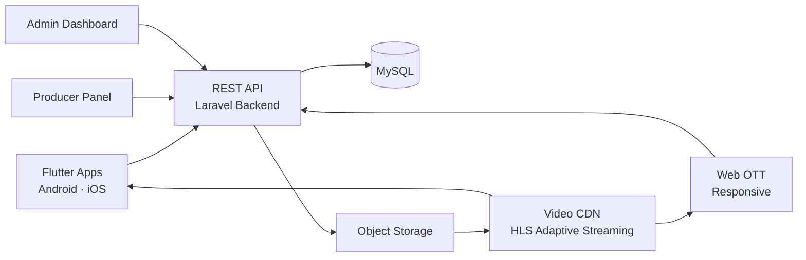

# Amazon Prime Video Clone — White-Label OTT & Video Streaming Platform by Miracuves

**MXTube** is a production-ready, white-label Amazon Prime Video clone: a complete OTT video streaming platform with subscriptions, rentals & pay-per-view, a producer revenue-sharing panel, and a full admin dashboard — delivered with **100% source code ownership** in **6 working days**.

> 🎬 **See it running before you talk to anyone.** Live user app, web OTT, producer panel, and admin dashboard — demo credentials are printed on the [solution page](https://miracuves.com/amazon-prime-video-clone#demo). No sales call required.

---

## 🚀 Live Demos

| Environment | URL | What you can test |
|---|---|---|
| 📱 User App (Android) | [mas.mimeld.com](https://mas.mimeld.com) | Browse, subscribe, rent, stream, watchlist |
| 🌐 Web OTT Platform | [mxtube.mimeld.com](https://mxtube.mimeld.com) | Full viewer experience in the browser |
| 🎥 Producer Panel | [Solution page → Demo](https://miracuves.com/amazon-prime-video-clone#demo) | Upload content, track watch-minutes, revenue share |
| 🛠️ Admin Dashboard | [Solution page → Demo](https://miracuves.com/amazon-prime-video-clone#demo) | Users, content, plans, rentals, payouts, analytics |

Demo credentials for all environments: **[miracuves.com/amazon-prime-video-clone → Demo section](https://miracuves.com/amazon-prime-video-clone/#demo)**

---

## ✨ What Makes This Amazon Prime Video Clone Different

Most OTT scripts stop at "watchlist + subscriptions." This platform ships with the features that actually run a streaming *business*:

- **Producer Revenue Sharing** — third-party content creators upload through their own panel and earn by watch-minutes — turns your platform into a content marketplace, not just a library
- **Four Monetization Models** — subscriptions (SVOD), rentals & pay-per-view (TVOD), advertising (AVOD), and premium bundles — run one or all simultaneously
- **Content Acquisition API** — pull licensed catalogs programmatically instead of manual uploads
- **360° VR Playback** — immersive content support out of the box
- **Smart TV Ready** — Android TV / Fire TV / Roku / Apple TV deployment available as an add-on

## 📦 Core Features

**Viewer:** multi-profile accounts · personalized homepage · search & filters · continue-watching · watchlist · offline downloads · multi-language subtitles · adaptive bitrate (HLS) · casting support

**Producer:** self-serve upload panel · content scheduling · watch-minute analytics · revenue dashboard · payout requests

**Admin:** user & subscription management · content moderation · plan & pricing control · rental management · producer payouts · revenue analytics · promo codes · CMS pages

## 🏗️ Architecture

**Stack:** Laravel (PHP) backend · Flutter mobile apps (single codebase, Android + iOS) · MySQL · HLS adaptive streaming via video CDN · payment gateway integrations (Stripe, PayPal, Razorpay & regional gateways)

## 📋 What’s Included

- ✅ Full source code — backend, web, mobile apps, panels (no encryption, no license locks)
- ✅ Deployment to your servers & app store submission assistance
- ✅ Your branding — white-label rename, logo, colors, domain
- ✅ 60 days post-launch support + 12 months of free updates
- ✅ Documentation & handover

**Pricing:** from **$3,699**, transparent on the [solution page](https://miracuves.com/amazon-prime-video-clone/#pricing) — no "contact us for quote" games.

## 🆚 Why Not Build From Scratch?

Custom OTT development runs $80k–$500k and 6–12 months. A proven white-label base gets you to market in 6 working days for a fraction of that, with your budget preserved for content licensing and marketing — the things that actually differentiate a streaming service.

## 📚 Resources

- 📖 [Amazon Prime Video Clone — Full Solution Page](https://miracuves.com/amazon-prime-video-clone) (features, pricing, demos, FAQ)
- 💰 [How Much Does a Netflix-Style OTT Platform Cost in 2026?](https://miracuves.com/amazon-prime-video-clone#pricing) pricing breakdown & what's included
- 📝 [Best Amazon Prime Video Clone Script in 2026: Features, Pricing & OTT Launch Guide](https://miracuves.com/amazon-prime-video-clone/blog/) features, pricing & launch guide
- 🧠 [Stop Trying to Be Amazon Prime Video: Why Hyper-Niche SVOD Wins](https://miracuves.com/amazon-prime-video-clone/blog/) lessons from category-leader SVODs
- ✅ [Miracuves Facts & Claims Ledger](https://miracuves.com/amazon-prime-video-clone/facts/) every claim we make, verified

## 🏢 About Miracuves

[Miracuves Solutions](https://miracuves.com) builds white-label clone apps and custom software from Mumbai, India — 90+ ready-made solutions, live demos for every product, transparent pricing, and delivery in 6 working days. Operating since 2010.

**Talk to us:** [WhatsApp](https://wa.me/919830009649) · [Schedule a consultation](https://miracuves.com/schedule-consultation/) · [miracuves.com](https://miracuves.com)

---

### ⚠️ Note on This Repository

This repository is a product overview. The full source code is delivered to clients on purchase — see [what’s included](https://miracuves.com/amazon-prime-video-clone/#included). For a hands-on evaluation, use the live demos above; credentials are public on the solution page.

*Keywords: amazon prime video clone, amazon prime video clone script, OTT platform development, video streaming app, white label OTT, VOD platform, SVOD AVOD TVOD, producer revenue sharing, Laravel Flutter streaming app*

---

<!--
══════════════════════════════════════════════════
TEMPLATE VARIABLE KEY — auto-generated from Netflix-Clone pattern
══════════════════════════════════════════════════
{APP_NAME}        Amazon Prime Video Clone
{MX_NAME}         MXTube
{CATEGORY}        OTT & Video Streaming Platform
{DEMO_WEB}        mxtube.mimeld.com
{PRICE}           $3,699
{SLUG}            amazon-prime-video-clone
{SOLUTION_URL}    https://miracuves.com/amazon-prime-video-clone/
{VERTICAL}        ott_streaming

See /tmp/verticals/ott_streaming.txt for the vertical config used to generate this README.
══════════════════════════════════════════════════
-->